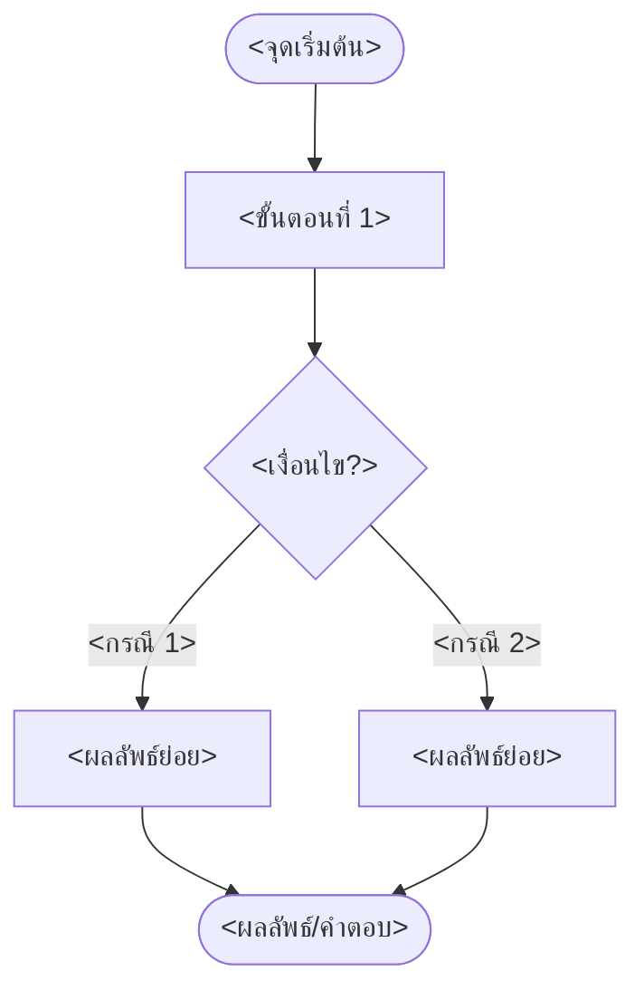

# {{title}}

⬅️ กลับไปที่ [[Week<N>-MOC|MOC สัปดาห์ <N>]] | ก่อนหน้า: [[<ชื่อโน้ตก่อนหน้า>]]

## 🔑 Keyword

- **<คำศัพท์/แนวคิดหลัก (English Term)>** — <คำอธิบายสั้น ๆ บรรทัดเดียว>
- **<คำศัพท์/แนวคิดหลัก (English Term)>** — <คำอธิบายสั้น ๆ บรรทัดเดียว>

## 📖 Theory (เข้าใจง่าย)

<อธิบายเนื้อหาหลักด้วยภาษาที่เข้าใจง่าย ใช้ตาราง/สูตร ($...$)/ตัวอย่างประกอบได้ตามความเหมาะสม แบ่งเป็นหัวข้อย่อยด้วย ### ได้ถ้าเนื้อหายาว>

> [!tip] เคล็ดลับ
> <เทคนิคช่วยจำ หรือวิธีเช็คคำตอบ>

## 🖼️ Diagram

<!--
ใส่ section นี้เฉพาะเมื่อหัวข้อมี "ขั้นตอน/กระบวนการ" ที่วาด flowchart แล้วช่วยความเข้าใจจริง ๆ เท่านั้น
ถ้าหัวข้อเป็นเนื้อหาบอกเล่า/นิยาม/ตารางล้วน ๆ ไม่มีลำดับขั้นตอน ให้ลบ section นี้ทิ้งทั้งหมด
-->

**ตัวอย่าง:** <ตัวอย่างประกอบสั้น ๆ พร้อมอ้างอิงเลขหน้าสไลด์ถ้ามี>

---
➡️ ต่อไป: [[<ชื่อโน้ตถัดไป>]]
