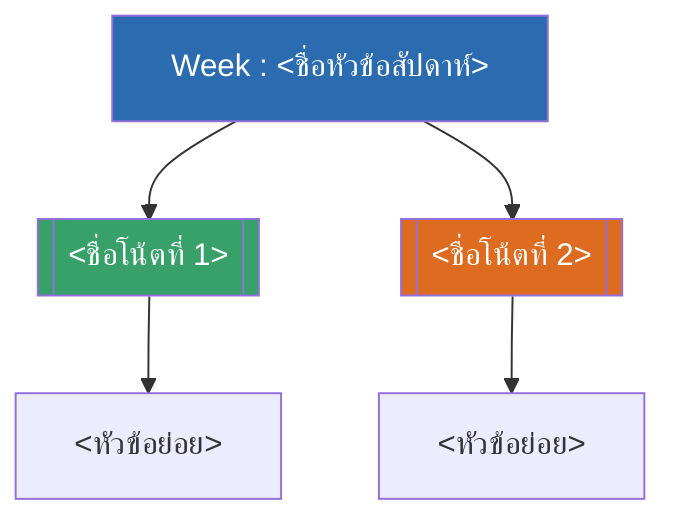

# Week <N> — <ชื่อหัวข้อสัปดาห์ภาษาอังกฤษสั้น ๆ> (MOC)

arrow_back สัปดาห์ก่อนหน้า: [[Week<N-1>-MOC|MOC สัปดาห์ <N-1>]]

<!-- ถ้าเป็นสัปดาห์แรกของวิชา (ไม่มีสัปดาห์ก่อนหน้า) ให้ลบบรรทัดนี้ทิ้ง -->

## check_circle เช็คลิสต์ก่อนเข้าเรียน

- [ ] <รายการเตรียมตัวก่อนเข้าเรียน> — ดู [[<ชื่อโน้ตหัวข้อ>]]
- [ ] <รายการเตรียมตัวก่อนเข้าเรียน>

## assignment ภาพรวมสัปดาห์ <N> (สรุปย่อ)

<ย่อหน้าสรุปภาพรวมเนื้อหาของสัปดาห์นี้ อาจแบ่งเป็นข้อย่อย 1. 2. 3. ตามหัวข้อหลักได้ถ้าเนื้อหามีหลายส่วน>

## map แผนที่หัวข้อสัปดาห์ <N>

## collections_bookmark โน้ตรายหัวข้อ

| หัวข้อ | เนื้อหาหลัก | หน้าสไลด์ |
| --- | --- | --- |
| [[<ชื่อโน้ตที่ 1>]] | <สรุปเนื้อหาสั้น ๆ> | <ช่วงเลขหน้า> |
| [[<ชื่อโน้ตที่ 2>]] | <สรุปเนื้อหาสั้น ๆ> | <ช่วงเลขหน้า> |

> [!tip] <หัวข้อ callout ปิดท้าย เช่น "จุดที่มักสับสน" หรือ "สัปดาห์หน้า">
> <เนื้อหา callout ปิดท้าย — เลือกใช้อย่างใดอย่างหนึ่งตามความเหมาะสม>

arrow_forward สัปดาห์ถัดไป: [[Week<N+1>-MOC|MOC สัปดาห์ <N+1>]]

<!-- ถ้ายังไม่มีโน้ตของสัปดาห์ถัดไป ให้ลบบรรทัดนี้ทิ้งไปก่อน แล้วค่อยเติมทีหลังตอนสร้าง MOC สัปดาห์ถัดไป -->
